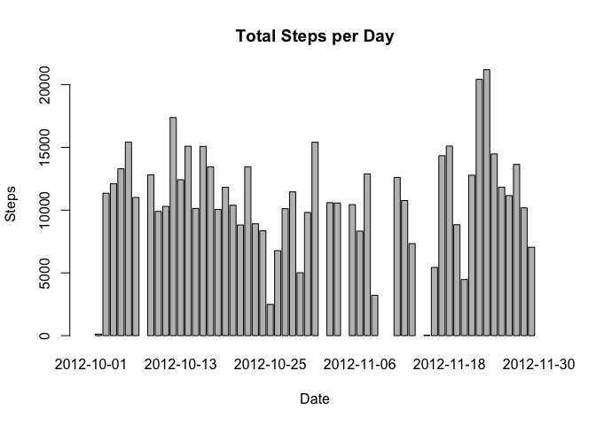
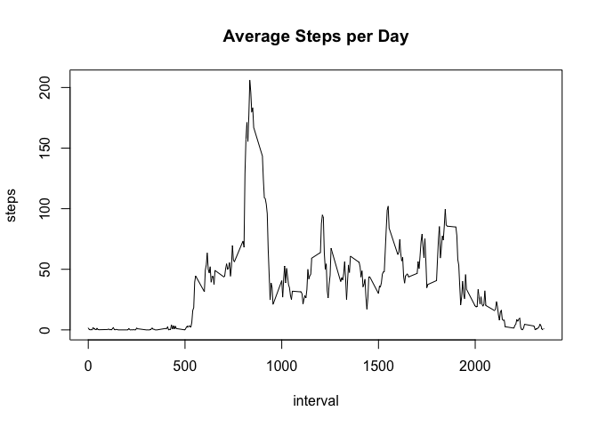
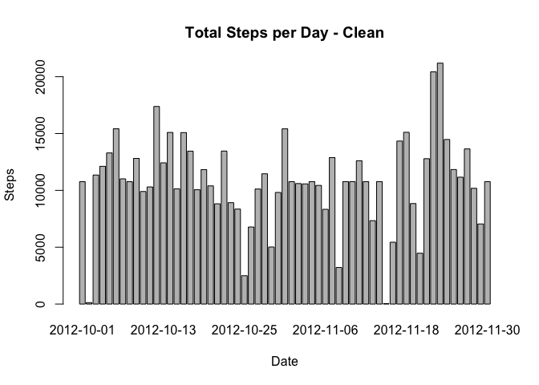

# Reproducible Research: Peer Assessment 1

This is a Markdown document for the processing of data for Peer Assessment 1 in the Reproducible Data course.

## Loading and preprocessing the data

Load the dataset.


```r
unzip("activity.zip")
data <- read.csv("activity.csv")
```

## What is mean total number of steps taken per day?

Create a new dataset `data.Date` that calculates the total number of steps taken per day. Rename the column names.


```r
data.Date <- aggregate(data$steps, list(data$date), sum)
names(data.Date) <- c("Date", "Steps")
```

Create a histogram from the `data.Date` dataset.


```r
barplot(data.Date$Steps, names.arg = data.Date$Date, xlab= "Date", ylab = "Steps", main = "Total Steps per Day")
```

 

Calculate and report the mean and median of the total number of steps taken per day.


```r
mean(data.Date$Steps, na.rm=TRUE)
```

```
## [1] 10766.19
```


```r
median(data.Date$Steps, na.rm=TRUE)
```

```
## [1] 10765
```

## What is the average daily activity pattern?

Create a new dataset `data.Interval` that calculates the average number of steps taken across all days based on the time interval.


```r
data.Interval <- aggregate(steps ~ interval, data = data, FUN = mean)
```

Plot a time series plot using the `data.Interval` dataset.


```r
plot(data.Interval, type = "l", main = "Average Steps per Day")
```

 

Determine which interval has the maximum number of steps.


```r
data.Interval$interval[which.max(data.Interval$steps)]
```

```
## [1] 835
```

## Imputing missing values

Calculate and report the total number of missing values in the dataset (i.e. the total number of rows with `NAs`).


```r
sum(is.na(data$steps))
```

```
## [1] 2304
```

Create a new complete dataset based on the following rules:

* Create a new dataset `data.complete` by taking the original dataset `data` and appending the values of average steps based on the interval from `data.Interval`

* Replace any `NA` values with the average steps per interval

* Create a new dataset `data.clean` with the average steps column removed


```r
data.complete <- merge(data, data.Interval, by = "interval", suffixes = c("", ".Avg"))
na.Steps <- is.na(data.complete$steps)
data.complete$steps[na.Steps] <- data.complete$steps.Avg[na.Steps]
data.clean <- data.complete[,1:3]
```

Create a new dataset `data.cleanTotal` that calculates the total number of steps taken per day using the `data.clean` dataset. Rename the column names.


```r
data.cleanTotal <- aggregate(data.clean$steps, list(data.clean$date), sum)
names(data.cleanTotal) <- c("Date", "Steps")
```

Create a histogram from the `data.cleanTotal` dataset.


```r
barplot(data.cleanTotal$Steps, names.arg = data.cleanTotal$Date, xlab= "Date", ylab = "Steps", main = "Total Steps per Day - Clean")
```

 

Calculate and report the mean and median total number of steps taken per day.


```r
mean(data.cleanTotal$Steps)
```

```
## [1] 10766.19
```

```r
median(data.cleanTotal$Steps)
```

```
## [1] 10766.19
```

**Note:**
There's no difference in mean value since we've used average values to fill the `NA` values in the dataset. The median value has risen to the mean value since this is the number we have averaged in (and have not rounded down/up).


## Are there differences in activity patterns between weekdays and weekends?

Create a new factor variable in the dataset with two levels – “weekday” and “weekend” indicating whether a given date is a weekday or weekend day. Add this value to the `data.clean` dataset as the variable `isWeekend`.


```r
isWeekend <- function(date) {
        if (weekdays(as.Date(date)) %in% c("Saturday", "Sunday")) {
                "weekend"
        } else {
                "weekday"
        }
}
data.clean$isWeekend <- as.factor(sapply(data.clean$date, isWeekend))
```

Make a panel plot containing a time series plot (i.e. type = "l") of the interval (x-axis) and the average number of steps taken, averaged across all weekday days or weekend days (y-axis).


```r
par(mfrow = c(2, 1))
for (type in c("weekend", "weekday")) {
    data.isWeekend <- aggregate(steps ~ interval, data = data.clean, subset = data.clean$isWeekend == type, FUN = mean)
    plot(data.isWeekend, type = "l", main = type)
}
```

 

**Observation:**
Weekend sees high activity level throughout the daywhile the weekday sees a peak at the beginning.
